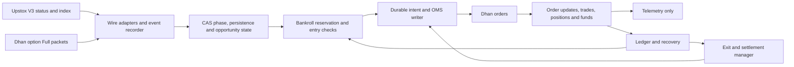

# SableStone NIFTY CAS: governing AUTO_LIVE production contract, revision 4

**Frozen:** 2026-09-13, incorporating the supplied September 12 AUTO_LIVE plan and six final clarifications. **Planning status:** COMPLETE. **Implementation and real-world verification:** OPEN.
**Authority:** this document specifies the build under the operator's stated strategy and bankroll constraints. The same agent owns design, implementation and verification; another audit, reviewer or historical package is not a prerequisite.
**Objective:** build a bot that can be armed with the operator's actual Dhan funds, execute the requested CAS strategy automatically when its conditions hold, manage every resulting order/position, and report actual net cash outcomes.

This is the governing implementation contract for one production mode, `AUTO_LIVE`, under one standing mandate. It incorporates the [supplied revision 4](evidence/operator-auto-live-plan-rev4.md), retains the precise behavior and acceptance work from revision 3, and resolves the six final ambiguities here. It supersedes earlier operational modes and the portable-package prerequisite. Build from the behavior specified here; previous source and conversations are optional reference material. The [20-task specification](TASKS.json) defines the acceptance work. Runtime credentials, account capital and live feed observations are commissioning inputs, not missing information needed to finish this plan.

## 1. Decisions and scope

1. Preserve the requested strategy: long same-day NIFTY CE/PE, official Upstox NIFTY indicative index as the active signal, Dhan Full option/future books, Dhan MARGIN LIMIT-IOC execution, reversal/re-lag, and post-auction residual opportunities.
2. Preserve the requested bankroll ceiling: below ₹40,000, at most `min(B, ₹10,000)` per lifecycle including entry charges; at ₹40,000 and above, at most `0.25 × B`. This is a ceiling, not a promise to fill it or a calibrated optimal allocation.
3. Permit repeated qualifying lifecycles and authorized exercise. A separately chosen commissioning cap may temporarily constrain a probe; it must not silently replace the production policy with a 1% limit or one-trade rule.
4. Build a focused CAS application in `sablestone_cas/` inside this repository. Reuse individual existing components where their actual contracts fit. The production package and official protocol adapters are deliverables; no legacy ZIP or unrelated research programme is a dependency.
5. One production release, one `AUTO_LIVE` decision/state machine, one standing mandate and one account writer. Replay and read-only tooling exercise the same implementation for developer verification; the operator does not promote between modes or select trading stages.
6. Keep entry qualification distinct from recovery. Loss of a signal, exhausted entry budget or missing pre-CAS reference must not disable broker reconciliation and authorized reduction of existing exposure.
7. Deliver one-time standing-mandate installation and service enablement, automatic funded-account calculation, a running `AUTO_LIVE` process and broker-write acceptance tests. Passing documentation checks or printing `entries_enabled=true` is not completion.

Planning is complete when strategy, accounting, failure behavior, interfaces, build order and release evidence are specified. Software completion requires implementing and verifying them. The same service automatically checks actual account and market facts in section 8; those checks are not manual promotions. These statuses remain separate; implementation does not wait for another planning approval or archive search.

## 2. Current market regime and a material new development

The current [NSE CAS schedule](https://www.nseindia.com/static/products-services/closing-auction-session) has a 15:15 reference transition, order collection from 15:20 and random cessation towards 15:30, followed by matching/confirmation; derivatives continue to 15:40. The [NIFTY contract specification](https://www.nseindia.com/static/products-services/equity-derivatives-contract-specifications) determines the actual expiry and holiday adjustment. Load current dated instruments, lot size, tick, freeze and broker cutoffs each session; weekdays alone do not establish an expiry or an open market.

**New on September 12:** SEBI published a [consultation paper](https://www.sebi.gov.in/sebi_data/attachdocs/sep-2026/1789202841824.pdf) proposing blended CTS/CAS or CTS-only derivative settlement, possible removal of the IEP-derived indicative index, and changed session times. These are proposals, not an operative replacement rule. The downloaded [official PDF](evidence/sebi-consultation-2026-09-12.pdf) is preserved with [provenance](evidence/sebi-consultation-source.json).

Engineering consequence: every policy must declare `settlement_regime`, `signal_definition`, effective date and session calendar. An enacted change affecting these fields disables the affected entry policy until implemented and revalidated. A consultation or cosmetic webpage change is recorded and evaluated; it does not itself rewrite the current exchange rules. If the official indicative index is withdrawn, the current active-CAS policy cannot execute as specified. A replacement signal would be a new strategy version, never a silent synthetic fallback.

### Authoritative rule and instrument inputs

| Required fact | Source and binding |
|---|---|
| Dhan security ID, underlying, expiry, option type, lot and tick | Current-session [Dhan detailed instrument master](https://images.dhan.co/api-data/api-scrip-master-detailed.csv), documented by [Dhan](https://dhanhq.co/docs/v2/instruments/): `EXCH_ID`, `SEGMENT`, `SECURITY_ID`, `INSTRUMENT`, `UNDERLYING_SYMBOL`, `SM_EXPIRY_DATE`, `OPTION_TYPE`, `STRIKE_PRICE`, `LOT_SIZE`, `TICK_SIZE`. Require NSE derivative NIFTY `OPTIDX` CE/PE; normalize segment and tick units through a versioned adapter validated against NSE specifications. |
| Maximum quantity per order | Effective NSE [Quantity Freeze CSV](https://nsearchives.nseindia.com/content/fo/qtyfreeze.csv), linked from [Contract Information](https://www.nseindia.com/static/products-services/equity-derivatives-contract-information), with applicable circular/date. Match NIFTY exactly; child size is `floor(freeze_units / lot) × lot`. A positive current Dhan `SM_FREEZE_QTY` may tighten this maximum but cannot enlarge the NSE limit. |
| Permitted prices | Current Dhan instrument master `SM_LOWER_LIMIT`/`SM_UPPER_LIMIT` and current broker feed/quote limits where supplied; use the tighter valid current restriction. Changed limits invalidate undispatched intents. Missing mandatory price-domain information blocks new entries for that instrument. |
| Session and expiry regime | NSE CAS, contract specifications, holiday/session notices and their effective circulars. The same-day master expiry must agree with the exchange calendar; don't infer it from Tuesday alone. |
| Dhan product deadline/RMS restriction | Versioned [Dhan RMS policy](https://dhan.co/risk-management-policy/), [market-session guidance](https://dhan.co/support/general/market-session-status-and-timing/) and an applicable later official Dhan notice. Bind rules to `NSE_FNO`, index options, `MARGIN`, date and action. Intraday square-off deadlines and stock-option physical-delivery restrictions must not be applied to this product. |

Each source record retains URL, raw bytes/digest, retrieval/publication time, applicability interval, parsed value, adapter version and affected operations. Fetch/revalidate for the session; an unchanged older effective publication can remain current, but yesterday's cache is never silently treated as a fresh check. Conditional HTTP revalidation counts. Unresolved missing/conflicting mandatory facts halt the affected new-entry operation, not account recovery. The initial policy has no guessed one-lot or old-freeze fallback. Recovery uses the last verified immutable contract identity plus current broker state and reconciles any reduction rejection; the bot never abandons an existing position because a public document is down.

CP04/CP17 bind broker restrictions by product and resolve precedence: an applicable later formal notice outranks generic guidance. An affirmative applicable policy can establish that `MARGIN` has no earlier scheduled deadline; absence of text alone cannot. Under-10-OPS operation is not a tagging exemption: the [NSE retail-algo FAQ](https://nsearchives.nseindia.com/web/sites/default/files/inline-files/FAQ_Retail%20Algo_03112025_NSE.pdf) says API orders require appropriate tagging within the threshold too. Verify Dhan's current account/API treatment automatically where exposed; never invent an order field or broker approval receipt.

## 3. Strategy behavior that must survive implementation

| Requirement | Binding behavior |
|---|---|
| Pre-CAS reference | Freeze the median of five distinct Upstox NIFTY observations received before the authoritative CTS_CLOSE boundary, using the exact cutoff contract below. Future reference is optional telemetry. Late restart restores the original; never manufacture a reference from late LTP. |
| Active auction | Current official NIFTY IEP/IIV plus same-contract executable option asks. Two distinct qualifying index observations in the same epoch establish persistence. Count provider observations, not repeated loop iterations or REST reads. |
| Contract-specific lag | Inspect eligible CE/PE contracts directly. No aggregate parity veto, constituent vote, arbitrary spread percentage, minimum ₹0.50 premium or 30/60-point displacement is introduced. A small move can qualify; a large already-priced move cannot. |
| Current book | An unchanged book can remain usable within its epoch while transport and subscriptions remain healthy. Newly reconnected instruments require new observations. LTT is not a book timestamp. |
| Sizing | Select whole lots against the actual five-level ask ladder, charges, available cash and remaining lifecycle ceiling. Recheck intent validity and reserve funds immediately before dispatch. |
| Additions | Additional fills in the same contract may use remaining lifecycle allowance after reconciliation and refreshed depth. Repeated reads cannot replenish consumed liquidity or mint new allowance. |
| Reversal | Reduce/close the held side when its documented reversal/lag-ending condition occurs. Enter the opposite side only after old order and position liabilities are reconciled. |
| Re-lag | UP → DOWN → UP and a fresh same-direction episode can produce further lifecycles. Counters are telemetry unless the operator explicitly selects a cap. Old signal/book IDs cannot repeatedly authorize new IOCs. |
| Post-stop | Preserve scanning on both CE and PE sides after collection stops. Distinguish provisional post-stop indication from a verified final settlement input. Never infer `final_locked` from clock time or three equal IEPs. |
| Exit | Implement the lag convergence, held-contract invalidation, joint IEP/bid reversal, direction reversal, session cutoff and emergency rules below. Test actual sell requests and partial fills. A peak bid is telemetry, never a hindsight fill price. |
| Exercise | Compare executable sale proceeds after charges with cash exercise under a verified final settlement input. Track held exposure as `SETTLEMENT_PENDING` until clearing/cash evidence arrives. Missing final confirmation means the guaranteed-settlement branch is unavailable. |
| Reuse of proceeds | Recompute bankroll only after lifecycle closure and broker cash reconciliation. Hypothetical profits, unconfirmed fills and unrecognized receivables cannot fund another order. |
| No-trade reporting | Every valid candidate ends as submitted, explicitly rejected, superseded or expired, with the binding reason and event IDs. Infrastructure rejection is never reported as absence of opportunity. |

### Exact official-index signal contract

`CAS_LAG_V1` subscribes in binary `full` mode to **`NSE_INDEX|Nifty 50`**. The production protobuf path is `FeedResponse.feeds["NSE_INDEX|Nifty 50"].fullFeed.indexFF.ltpc.iep.value`. Require the `FeedUnion` to be `fullFeed`, its `FullFeedUnion` to be `indexFF`, LTPC message presence, and `ltpc.HasField("iep")` for the `google.protobuf.DoubleValue` wrapper. Its value must be finite and strictly positive. Missing wrapper is not zero; neither `ltp`, `cp`, a marketFF stock IEP nor another index can substitute. These are the [official V3 schema semantics](https://upstox.com/developer/api-documentation/v3/get-market-data-feed/); the [instrument reference](https://upstox.com/developer/api-documentation/instrument-search/) identifies the NIFTY key. Actual population remains a runtime fact to observe.

CAS state comes only from `FeedResponse.marketInfo.casMarketStatus["NSE_EQ"].status` with `updatedTime` in epoch milliseconds. `CTS_CLOSE` establishes the reference boundary, `CAS_LM_START` opens collection, `CAS_M_STOP` continues collection for this strategy, and `CAS_STOP` ends active-auction entry. Missing/unknown state or inconsistent trading date cannot authorize entry. Healthy unchanged status persists within its epoch; a reconnect requires a new status snapshot. Status-only frames and unrelated instrument frames never create NIFTY observations.

Preserve frame `currentTs`, decoded index payload, connection epoch, receiver sequence, wall/monotonic receipt and raw-frame identity. Deduplicate the same epoch/key/provider-timestamp/relevant-payload tuple. A later true index observation may have the same numeric indication and count as distinct; polling a cached object, duplicate delivery, or a status heartbeat cannot. Provider timestamp is not falsely described as an exchange sequence number. Require two distinct current-epoch observations after reconnect before another active entry; no constituent reconstruction or REST fallback can authorize it.

### Exact reference boundary and future telemetry

Let `T` be the same-session Upstox `NSE_EQ` CAS status `updatedTime` for the authoritative `CTS_CLOSE` transition. Use five distinct NIFTY **LTP** observations from before `T` for the reference, and IEP only for subsequent active-auction decisions. Persist the boundary event and the exact selected event identities in one reference transaction.

`CAS_LAG_V1` reference limits are **30 seconds maximum age**, **100 ms maximum host UTC uncertainty**, and strict exclusion at the boundary. For every selected NIFTY observation require `T - 30s <= frame.currentTs < T`, `T - 30s <= received_utc`, `received_utc + clock_uncertainty < T`, and receiver sequence before the CTS_CLOSE event. Reject snapshots as reference samples; use actual distinct live observations in the Upstox epoch that contains the transition. Sort eligible observations by provider timestamp then receiver sequence and select the latest five. Five are required for the NIFTY reference; do not backfill from REST or repeat one cached value. These age bounds are explicit policy settings, not exchange claims.

Stamp ingress before work is queued and serialize boundary processing with observation ingestion. On delayed CTS_CLOSE delivery, only already-received events satisfying the above timestamp bounds remain eligible; no late-arriving historical event may be inserted after freezing. Exclude equal-time and clock-uncertain cases. A missing/contradictory CTS_CLOSE boundary leaves `REFERENCE_UNAVAILABLE`, while exits/recovery continue. At the expected 15:15 wall-clock transition stop provisional reference collection pending the authoritative event; wall time does not itself establish a valid frozen reference. Reordered worker execution therefore cannot move a post-boundary quote into the reference.

The Dhan future is **telemetry only everywhere in `CAS_LAG_V1`**: signal direction, candidate admission, book readiness, route proof, reference validity, sizing, exits and service readiness cannot depend on future presence, direction, basis or freshness. When available, freeze the median of its last five distinct pre-`T` observations within the same 30-second receipt window/current Dhan epoch. Store LTT as a last-trade timestamp, never a book-update timestamp; it may validate the sampled traded price but cannot establish book freshness. Insufficient future events produce `FUTURE_REFERENCE_UNAVAILABLE` and do not veto an otherwise eligible trade. Missing future metadata similarly disables only its telemetry subscription. Upstox NIFTY and Dhan option state remain authoritative for entries.

A restart restores the exact immutable same-session reference. A later signal reconnect resets signal persistence, not that already committed reference; before a reference is frozen, a reconnect discards provisional samples. Reference corruption or absence blocks reference-dependent entries but never exposure reduction. CP05 must prove identical reference selection under reordered processing, rejection of late/equal-time samples, and identical entry decisions with the future completely unavailable or moving the opposite way.

Active IEP is provisional. A positive `target_profit` is conditional target arithmetic; `expected_profit` remains unknown until supported by an outcome model. The deterministic lag policy can be evaluated under an explicitly funded experimental mandate; statistical research must not silently change its trigger. A calibrated expected-value policy is a separately versioned option, with comparison against the original required before promotion.

### Frozen candidate algorithm

The first implementation uses the named `CAS_LAG_V1` policy. Its complete entry mechanics are:

1. Freeze the NIFTY median using the exact boundary contract above. If five qualifying future observations exist, also record their median as telemetry; otherwise record FUTURE_REFERENCE_UNAVAILABLE without blocking a valid NIFTY/option entry. Repeated sampling cannot manufacture observations.
2. Subscribe to the same-day NIFTY chain within verified feed/account limits, preserving coverage of held contracts and both option sides. If limits force selection, report the uncovered strikes; never claim full-chain detection from a narrow band.
3. Direction is the sign of current official indicative index minus frozen NIFTY reference: positive selects CE, negative selects PE, and equality admits no active-auction entry. A current valid ask must be at least one contract tick below current intrinsic, with at least one lot of qualifying entry depth and a valid bid-side observation.
4. Intersect qualifying security IDs over the latest contiguous same-direction, same-epoch history (bounded at 24 observations). Require at least two genuinely distinct qualifying index observations. Maintain the minimum observed intrinsic for each persistent contract as its conditional target floor.
5. Enumerate valid tick-aligned limits from the five ask levels below that floor, respecting price bands. Compute finite units available up to each limit, then whole-lot cash/fee/reservation capacity. Use the conditional-edge score defined below, with stable instrument-ID tie-breaking. This is a deterministic heuristic, not proof of globally optimal expected wealth.
6. Hold one managed option security at a time. Additions use only the same security and remaining lifecycle allowance. New opposite-direction lifecycles require closing/reconciling the old one first.
7. Revalidate current price/depth/episode/authority immediately before each child dispatch. A prior positive signal must not authorize a child after the lag disappears. A zero-fill IOC consumes its episode/attempt identity but does not ban future independently refreshed opportunities.

Document every deliberate deviation from these mechanics as a new policy version with before/after replay. A new probability threshold, wider strike exclusion, mandatory minimum premium or trade-count cap must not enter through an infrastructure fix.

For strike `K` and official indicative index `I`, intrinsic is `max(I-K,0)` for CE and `max(K-I,0)` for PE. The active target `T` is the minimum intrinsic over the qualifying contiguous observations. Both top ask and top bid must contain at least one current contract lot for an active-auction entry. This is an intentional `CAS_LAG_V1` strategy filter: a missing/zero/thin bid returns `POLICY_BID_DEPTH_BELOW_ONE_LOT`, while feed health remains independently classified. Keep it to require observed exit liquidity while the IEP is provisional; it still cannot guarantee a later sale. Compute all cash using Decimal:

```text
Q = selected whole-lot units
L = selected IOC buy limit
entry_cash = Q × L + buy_fees(Q × L, planned_child_count)
conditional_sale_cash = Q × T - sell_fees(Q × T, planned_child_count)
conditional_edge = conditional_sale_cash - entry_cash
score = (conditional_edge / entry_cash, conditional_edge, Q)
```

Require positive conditional edge after fees. Among eligible contracts and limits, maximize this tuple; break a remaining tie by ascending security ID then ascending limit. For each limit, evaluate one lot, the maximum feasible lot quantity, every freeze-compliant child boundary and one lot below each boundary. Post-stop substitutes qualified net exercise value for conditional sale cash when its exercise policy applies. The limit-price reservation deliberately covers worst-case permitted premium rather than assuming every displayed level fills at its best price.

### Exit policy to preserve and test

During active auction, exit when the signal becomes invalid, its direction opposes the held contract, the held security leaves the persistent set, or its intrinsic-minus-ask lag disappears. Convergence uses `max(contract tick, sell_fees(bid × one lot, 1) / one lot)` as its cost floor. The joint reversal condition is current indicative intrinsic plus one tick below its observed peak **and** current bid plus one tick below its observed peak. It does not require an arbitrary profit multiple. Test these conditions with separate positive fixtures; distinguish transport invalidity from a real reversal in reporting.

With a qualified final input, exit when the executable bid reaches the target minus that cost floor, or hold for cash settlement only when authorized net exercise value exceeds executable net sale value. Normal sale limits start two ticks below the current bid; emergency limits start ten ticks below, then clamp to the actual tick and permitted band. With no valid bid, an authorized bounded emergency IOC may attempt the lowest permitted positive limit; that cannot guarantee a fill. Reconcile before replacing any unresolved sale. Missing option data must not bypass the time-exit/recovery branch; every child respects the current freeze quantity.

Sale-versus-exercise comparisons use the finite current bid ladder, actual managed quantity, child charges and settlement taxes. Do not multiply the best bid by more units than its depth supports. Evaluate supported sale slices separately from the remainder; every actual fill and remaining exposure is reconciled. Displayed sale proceeds remain conditional until filled.

## 4. Real bankroll, exact accounting and mandate

Let `B` be broker-reconciled strategy equity at the start of a lifecycle, bounded by the operator's capital allocation. Unrelated account funds and collateral are not automatically strategy money. For the first long-option lifecycle, no open position is assumed.

```text
R(B) = 0                        if B <= 0 (no new entry)
R(B) = min(B, 10000.00)           if 0 < B < 40000.00
R(B) = floor_to_paise(0.25 × B)   if B >= 40000.00

remaining_lifecycle_allowance = R(B)
    - cumulative actual entry premium - all lifecycle entry charges
    - unresolved entry reservations

incremental_order_cash = maximum limit-price premium + incremental entry charges

incremental_order_cash <= remaining_lifecycle_allowance
incremental_order_cash <= verified broker spendable cash not already committed
incremental_order_cash <= remaining selected debit cap, if a cap is configured
```

`B` and `R(B)` remain frozen while a lifecycle is open, including partial exits/additions. A partial exit does not replenish its cumulative entry allowance; this prevents repeated partial-loss/rebuy cycles exceeding the stated total entry-risk ceiling. At complete closure, recompute from the durable strategy ledger and a sufficiently recent broker funds/positions snapshot, incorporating only broker-permitted reuse. Report settled cash, reusable funds, receivables, withdrawable cash, reserved entry cash, estimated liquidation equity and realized P&L separately. Match snapshot timestamps to local reservations so the same broker-blocked amount is not deducted twice.

Changing a position label to `SETTLEMENT_PENDING` does not financially close its lifecycle or release its allowance. Keep remaining position/settlement liabilities, fees and cash claims attached to that lifecycle until broker/clearing/cash reconciliation establishes closure. The initial one-security policy opens no overlapping lifecycle while those liabilities remain unresolved; it never counts a receivable as spendable cash.

Money is Decimal or integer paise; exchange price inputs are normalized once to integer ticks/Decimal with validated precision. Reject non-finite monetary inputs, negative prices/fees/reservations and non-integral contract quantities. Signed cash postings, losses and negative net equity must remain representable; nonpositive equity grants no new-entry allowance. The JSON wire encoding must preserve exact tick prices even where the broker schema uses a JSON number.

| Bankroll B | Requested lifecycle ceiling |
|---:|---:|
| ₹9,411.18 | ₹9,411.18 |
| ₹10,000.00 | ₹10,000.00 |
| ₹25,000.00 | ₹10,000.00 |
| ₹39,999.99 | ₹10,000.00 |
| ₹40,000.00 | ₹10,000.00 |
| ₹80,000.00 | ₹20,000.00 |
| ₹100,000.00 | ₹25,000.00 |

At small bankrolls this policy can lose the full invested premium. Represent that explicitly in the arming preview; do not claim the rule prevents ruin or replace it without the operator's instruction.

### Canonical conditional sizing acceptance

For the fixed arithmetic fixture, `B=9411.18`, lot 65, 23,650 PE ask ₹11 and available depth 845 produce 13 lots / 845 units with modeled entry cash `9322.7856981881` before ledger currency rounding. With depth 195, maximum size is 3 lots / 195 units. These are synthetic capacity cases. A hypothetical later sale at ₹95 remains a conditional outcome, not proof that the price was obtainable.

The fixture is specified here and needs no legacy source: for premium turnover `P` and executed child count `n`, brokerage is `20n`, exchange fee is `P × 3552/10000000`, SEBI fee is `P × 10/10000000`, IPFT is `P × 0.01/10000000`, buy stamp is `P × 0.00003`, sell STT is `P × 0.0015`, and GST is `0.18 × (brokerage + exchange + SEBI + IPFT)`. Sum the applicable components. These frozen regression inputs are not an assertion of the live tariff. The implementation loads effective-dated live fees and rounding rules, compares them with contract notes, and keeps the fixture separate. Reserve currency debits rounded upward to the paise; reconcile actual posted debits rather than inventing their rounding.

### Standing authority, not approval on each opportunity

One local mandate records account and strategy identity, source/release compatibility, valid sessions, capital-allocation rules, the lifecycle formula, permitted products, optional turnover/loss caps, bounded qualification probes, and exit/recovery/settlement authority. Defaults grant zero writes until this mandate is explicitly authorized. Actual funded equity is read from the broker at arming; entering a number is not deposit evidence.

Production turnover and money-at-risk are separate. The mandate must explicitly contain `cumulative_entry_debit_cap`: `null` means no cumulative turnover ceiling, and a nonnegative Decimal amount means a finite cap. Omission is invalid, never silently converted to zero or a hidden default. `debit_cap_scope` is `session` or `mandate` when a finite cap is selected; `null` uses scope `none`. A zero cap intentionally disables new purchases. The operator may select a session cap without permanently exhausting future sessions.

All debit counters persist as telemetry. A finite mandate cap cannot reset through restart/re-arm; a finite session cap resets only at the next verified exchange trading-date boundary, while unresolved reservations remain committed against cash and their original scope. Wins do not replenish finite turnover caps. With a null cap, repeat lifecycles continue while current bankroll/cash, the fixed lifecycle ceiling, market and route permit them. Optional loss/drawdown/trade-count limits are likewise explicit. This operator-selected production rule supersedes the earlier blanket lifetime turnover cap; commissioning/probe and cloud spending limits remain bounded.

Capital allocation must state whether realized strategy profits compound (`reinvest_realized_profit=true` by default for this strategy) and may carry a separately selected equity ceiling. Broker-reconciled initial allocation plus realized retained net P&L defines `B`; unrelated deposits and collateral do not automatically become strategy capital. No fresh cash top-up is performed by the bot. Route-probe authority contains finite per-session attempt/debit limits and an explicit finite mandate-wide probe spending ceiling; restarting/reconnecting cannot reset them. Probe budget exhaustion is a visible qualification reason, never a concealed strategy trade-count limit. Routine probes within this standing budget need no new approval.

Entry and exit allowances are separate. A depleted entry cap prevents new purchases, while sells that reduce a known long and broker reconciliation remain allowed. Reserve capacity and fees for these operations. Never permit an exit to sell more than verified remaining long quantity after all pending sells.

Use current [Dhan funds/margin fields](https://dhanhq.co/docs/v2/funds/) and actual tariff/contract notes. Available balance, collateral and withdrawable balance are distinct. Margin observations are session-bound; cache validated long-option requirements outside the critical path and update when the contract/account changes. Broker rejection remains possible and must reconcile cleanly.

## 5. Concrete production design



Production modules: `config`, `instruments`, `clock`, `upstox_v3`, `dhan_feed`, `dhan_orders`, `capture`, `ledger`, `cas_state`, `strategy`, `risk`, `oms`, `exits`, `recovery`, `runtime`, `cli`. These are responsibilities inside one service, not separate agents or microservices.

Use Python 3.12, one asyncio event loop for feeds/decisions, the `websockets` client, generated `protobuf` bindings and HTTPX async REST clients. Pin exact compatible dependency/compiler versions in CP00/CP01 and ship a lockfile. Broker SDKs are unnecessary. Keep credential refresh, instrument downloads and disk compression outside the decision loop. A dedicated bounded ledger worker owns SQLite; commit acknowledgements precede order dispatch. Use WAL with synchronous FULL for money transitions. Separate recovery network capacity from entry traffic so a slow entry request cannot starve account reconciliation.

Start with a single-writer SQLite WAL ledger and bounded append-only raw-frame storage. Tables cover accounts/mandates, session references, source rules, opportunities, intents/reservations, broker attempts/orders, unique trade fills, positions, cash postings, settlement receivables, rate/debit counters and incidents. Commit intent plus reservation atomically; record the send attempt before network dispatch. Synchronize durable money transitions, test power-loss recovery and WAL-consistent backups, and never treat a restored local database as newer than broker truth without reconciliation.

### Protocol contracts

- Use the [official Upstox V3 protobuf](https://assets.upstox.com/feed/market-data-feed/v3/MarketDataFeed.proto), including wrapper presence for `LTPC.iep`, `IndexFullFeed`, `FeedResponse`, segment/CAS status and provider timestamps. The [fetched copy](evidence/official-upstox-v3.proto) has SHA-256 `3e1c939dce2c83a3fef91405c5ca268dfa089aae973319f56685f12a5afcf612`. Generate Python code reproducibly and pin compiler/runtime dependencies. Do not reuse the Alpha `FixtureEnvelope` as the official protocol.
- Status observations establish phase; they never manufacture an index tick. Retain unchanged phase within a healthy epoch according to the documented event semantics. A reconnect clears observations that need a new snapshot. Optional unknown protobuf fields may be ignored; missing required semantics, unknown critical enums or invalid wire data cannot authorize entry.
- Validate Dhan packet code/declared length/segment/security ID/depth against subscriptions. Preserve control packets and disconnect codes. Do not require a subscription-ack message that the documented feed does not promise; current-epoch instrument packets establish data coverage.
- [Dhan's feed](https://dhanhq.co/docs/v2/live-market-feed/) uses WebSocket ping/pong and event-driven binary updates. Measure transport liveness separately from book update age. Invalid/foreign packets cannot refresh required-instrument health. Lack of sequence numbers means no claim of provable gap-free delivery.
- Record provider timestamps, wall-clock receipt, monotonic receipt, connection epoch and instrument-update IDs. Compare timestamps by their actual meaning; do not label local snapshot construction time as a provider/book update.
- Preserve raw evidence and redact authorization headers, feed URLs containing tokens, PINs and TOTP material. Record sufficiently durable decision-input references before an order is emitted. A slow recorder has bounded queues and disables entries before losing required evidence; risk management has reserved resources.

### OMS and recovery contracts

Persist intent and worst-case reservation before write. Dhan correlation IDs support retrieval; [the order contract](https://dhanhq.co/docs/v2/orders/) does not establish that repeated POSTs with the same ID are broker-deduplicated. A lost response becomes `SEND_UNKNOWN`. Reconcile by correlation/order IDs, order book, trades and positions before retry; an absent immediate lookup is not proof that submission never happened.

Track every slice independently, including discovery of children missing from the first response. A partially filled IOC stays nonterminal until the remaining quantity is terminal at the broker. Never clear UNKNOWN/PENDING merely because filled quantity is zero. Prefer client-managed freeze-compliant child intents unless the server-slicing route's complete child discovery is commissioned. Rate budgets and per-child fees apply in either path.

Apply fills once by broker trade identity. Cumulative filled quantity is monotonic; duplicate events are idempotent, older events cannot erase fills, and contradictory events trigger reconciliation. Bind every update to account, order, instrument and product. For any partially exited long, subtract still-live sell quantities before issuing a replacement sell.

On restart, acquire the account writer lock and reconcile **before** calendar/no-trade checks or signal startup. Recover known exposure even on a holiday, next day, missing reference, unavailable Upstox, or changed entry policy. Preserve unresolved orders and settlement receivables. Healthy flatness requires broker evidence; process-local quantity zero is insufficient.

Use a persistent governor for the documented rate buckets, with priority/reserved capacity for cancels, exits and recovery reads. Reject a new entry whose deadline cannot fit available capacity; never queue it past opportunity expiry. Failure of entry qualification, telemetry or the upstream signal cannot require proof of profitable alpha before an exit.

The current [Dhan API limits](https://dhanhq.co/docs/v2/) are 10 order calls/second, 250/minute, 1,000/hour and 7,000/day; revalidate their effective contract. Pace below the per-second ceiling, enforce every bucket simultaneously, and count attempts including ambiguous requests conservatively. Use rolling windows where broker reset semantics are undocumented. Account for other known account/API traffic and halt entries on unexplained rate usage; the governor cannot claim control over an unrelated manual/API client. Quote/data/non-trading read APIs have separate documented limits.

For each published order-rate bucket reserve at least enough mutation slots to close all managed long slices, including the potential fills of pending/proposed buys, with a minimum of one slot. Entry admission accounts for its own planned child writes plus that resulting exit reserve; a multi-child entry cannot consume the capacity needed to unwind its fills. Priority is reconciliation of uncertain exposure, cancel/exit, qualification probe, then entry. Broker read limits have separate counters and reserved recovery capacity. Before using the final hourly/daily mutation slots, halt new purchases and preserve enough capacity for all current long slices; a finite broker limit cannot guarantee unlimited emergency retries, so exhausted capacity remains a visible incident rather than a false-flat result.

### Post-stop settlement is a separate capability

Use `COLLECTION_STOPPED`, `FINAL_INPUT_PENDING`, `FINAL_INPUT_CONFIRMED`, `SETTLEMENT_PENDING` and `SETTLED` as distinct states. The required final-value source is an official NSE closing/settlement value delivered through a documented provider or exchange publication, with date and finality semantics. Its adapter emits `{index_key, trading_date, value, source, source_field, published_at, received_at, revision, settlement_regime, finality_kind}`. Compare it retrospectively with clearing settlement and reconcile revisions. [NSE settlement rules](https://www.nseindia.com/static/products-services/equity-derivatives-settlement-price) supply the payoff basis; a schema or clock does not prove timely delivery of the final value.

CP12 owns source discovery and adapter implementation: inspect the documented Upstox index-close fields and official NSE index-close/settlement publications, capture their dated publication behavior, and select a source only if its semantics and delivery time satisfy that contract. A provider's previous-close or provisional OHLC field is rejected. No user research or additional plan approval is required. If a confirmed value arrives before the entry cutoff, scan both CE and PE for fee-positive residuals; if it arrives later, use it for settlement accounting only. If no timely supported source exists, publish that capability result and retain the implemented branch in an unqualified state. This is a bounded integration decision, not an undefined trading rule.

The same `AUTO_LIVE` process selects a supported final-input adapter and uses it automatically. No operator enablement is required when a verified value arrives in time. Without one, log `FINAL_INPUT_UNAVAILABLE`, continue exits/recovery/settlement tracking, and send no final-value-dependent entry. `CAS_LAG_V1` contains no extra provisional post-stop entry strategy; an implementer must not invent one to keep trading after collection. Absence of final input for one session is a market/capability result, not a manual stage or evidence that the entire service is disabled.

This restriction applies to new decisions that depend on final value. It never suppresses exits, unavoidable-expiry tracking or settlement/cash reconciliation for existing exposure. Software completeness includes implementing and testing the automatic final-value branch; real-source verification remains an honest status field and cannot be fabricated from fixtures.

No new entry may be sent after its exit-policy cutoff. For the currently documented 15:40 derivatives close, stop new post-stop entries at 15:38:30 and start forced liquidation at 15:39:00, except for an explicitly authorized hold supported by confirmed final value. In general, let `C` be the earliest applicable broker/exchange close: entry cutoff is `C - 90 seconds`, force-exit begins at `C - 60 seconds`. active-auction entry stops at the earlier of actual CAS_STOP and the effective collection cutoff. Continue authorized exit attempts while the broker accepts them and continue reconciliation after close; a script end timer must not erase exposure. CP10/CP12 test the exact cutoff boundaries, earlier broker deadlines and a changed regime.

## 6. One AUTO_LIVE service and automatic qualification

### Operator workflow

Configure account credentials, permanent Dhan-whitelisted egress, the standing mandate and deployment once, then enable the scheduler. The production service always runs `AUTO_LIVE`; it has no diagnostic-to-shadow-to-live promotion chain, no separate active/post-stop mode selector, and no per-trade approval. Market phase and capability checks are internal automatic state transitions.

These are required CLI interfaces for the build, not commands claimed to exist today:

```bash
sablestone-cas configure --config production.toml --mandate mandate.json
sablestone-cas enable --config production.toml
sablestone-cas status --json
sablestone-cas disarm --new-entries
sablestone-cas reconcile --through-settlement
```

`configure` validates and persists the one-time scope. `enable` schedules the service and displays funded capital, risk/cap policy, account, egress and unresolved facts. The scheduler invokes `sablestone-cas run --mode AUTO_LIVE --config production.toml`; the operator does not launch a second copy. Actual order admission rechecks its requirements automatically. Disarm remains an operator stop control; it prevents entries and preserves recovery without introducing a trading-stage toggle. Selftest, replay, capture and read-only shadow tools remain available to the developer with broker writes mechanically denied; running them is never a recurring operator prerequisite or a production promotion step.

Service state may be `DISARMED`, `ARMED_WAITING_SESSION`, `RECOVERING`, `QUALIFYING`, `ARMED_WAITING_SIGNAL`, `ENTRY_PENDING`, `POSITION_OPEN`, `EXIT_PENDING`, `FINAL_INPUT_PENDING`, `SETTLEMENT_PENDING` or `ENTRY_HALTED`. These describe what AUTO_LIVE is doing; they do not require clicks. The only operator decisions are initial capital/authority/configuration, voluntary stop, and a later material change to that scope.

### Startup order and route proof

1. Acquire the local account-writer lock and open the ledger. Authenticate Dhan **before** requesting orders/trades/positions/funds. Reconcile unresolved exposure and begin authorized recovery before calendar or Upstox availability can decide new entries.
2. For an eligible expiry, validate current instrument/rule/account/cash inputs. Start Upstox and Dhan option/order streams; subscribe to future telemetry when available. Reference observation begins independently of route-probe completion.
3. Validate the standing mandate for this session. A new order-stream epoch starts unproven. A valid current-epoch broker event may supply the required evidence; otherwise automatically construct the budgeted one-lot qualification IOC.
4. The qualification intent needs verified account, egress, funding, contract and recovery capacity. It does **not** need an earlier order-stream event, pre-CAS reference, NIFTY IEP, future packet or profitable-alpha evidence. Missing strategy indication cannot prevent the probe from bootstrapping the route.
5. Persist the probe intent/reservation and send attempt through the production OMS. Require broker acceptance and its exact-account/order/current-epoch stream echo; reconcile all order/trade/position state. A zero-fill proves that route only. Any unexpected fill enters managed recovery, and strategy entry waits until the probe is reconciled. Reserve its possible premium, fees and exit capacity because a low-limit IOC can fill.
6. Attempt/retry/reconnect consumes the mandate's finite probe counters. Before the effective **15:19:30** qualification cutoff, automatically requalify a new epoch if its bounded allowance remains. After cutoff, no new qualification probe is sent; entries wait unless valid current-epoch proof is established from a suitable existing order event. Existing exposure is managed through available order updates and REST reconciliation throughout.

For the initial route-selection policy choose the cheapest valid one-lot same-day NIFTY option qualification reservation, with a positive bid, at the lowest positive permitted tick-aligned buy limit strictly below that bid. Require the full possible debit to fit the explicit probe budget and spendable cash. Break ties by security ID. If no valid non-marketable probe fits, report the precise reason and continue safe observation/recovery; never submit an invalid-price test or consume strategy allowance secretly. The setup schema requires finite positive `probe_max_attempts_per_session`, `probe_entry_debit_cap_per_session` and `probe_spending_cap_per_mandate`; no hidden default is used. Reserve worst-case probe exposure against these bounds before submission, then replace reservations with actual debits and fees after terminal reconciliation; attempts remain consumed even for a zero-fill.

A rejected order does not qualify route acceptance. An ambiguous response is SEND_UNKNOWN, never an excuse for another probe POST. A socket connection is transport evidence only. Prior release-level compatibility does not qualify a fresh connection epoch. Conversely, the process can be enabled before the day's IEP and order echo exist: it starts in waiting/qualification state and does the work itself.

## 7. Acceptance tests must prove both action and refusal

All commands below are planned tests to implement under `tests/acceptance/cas/`; they have **not** passed yet. The test runner must fail if an exact case or production path is missing. Every case uses the real production module unless explicitly marked as live commissioning. An isolated local broker simulator owns the independent request/trade/cash oracle. Fixtures never call the real broker.

| Task / exact command suffix | Dependency | Required positive, negative and recovery behavior |
|---|---|---|
| CP00 `test_cp00_package.py` | none | Build/install the new portable wheel from repository source in a clean environment with no historical archives; bind its own version/dependencies/digest; reject missing dependency or substituted artifact; preserve state on reinstall. |
| CP01 `test_cp01_protocol.py` | CP00 | Official Upstox binary NIFTY IEP/status and Dhan Full decode; wrong wrapper/length/segment rejected; status-only reconnect cannot reuse old market state; additive optional fields accepted. |
| CP02 `test_cp02_recorder.py` | CP01 | Raw/frame/event identity and timestamps preserved; credential redaction; queue/disk failure blocks entry without erasing outstanding risk; recover committed log tail. |
| CP03 `test_cp03_capture.py` | CP02 | Installed capture process connects to three protocol-faithful local endpoints and stays alive; captures required events; no order POST/PUT/DELETE even if live config strings leak in; reconnect resumes capture. |
| CP04 `test_cp04_calendar.py` | CP01 | Current Dhan identity/lot/tick, NSE freeze/calendar and product-scoped broker deadlines with dated provenance; future metadata optional; stale/misapplied rules rejected; recovery before no-trade. |
| CP05 `test_cp05_strategy.py` | CP01, CP04 | Exact five-sample pre-CTS_CLOSE reference and clock/age boundaries; future absent/opposite never vetoes; explicit one-lot bid policy; distinct single-contract lags and reconnect qualification. |
| CP06 `test_cp06_bankroll.py` | CP00 | Every bankroll boundary and 845/195 sizing; explicit null/zero/finite turnover scopes; exact reservations and realized-profit compounding; partial exit/settlement labels cannot replenish allowance. |
| CP07 `test_cp07_orders.py` | CP01, CP06 | Durable intent → exact MARGIN LIMIT IOC request → terminal fills; lost response reconciles without duplicate submit; missing children and PENDING stay unresolved; repeated/out-of-order events cannot double-count/erase fills. |
| CP08 `test_cp08_recovery.py` | CP07 | SIGKILL before send, after accept-before-response, after fill-before-ledger and during exit; recover one intent/position; unknown broker state blocks new entries; missing Upstox/reference/calendar does not block recovery. |
| CP09 `test_cp09_route.py` | CP07, CP08 | Automatic bounded IOC bootstrap without prior echo/IEP/reference/future; concurrent reference capture; accepted current-epoch echo; unexpected-fill recovery; bounded pre-cutoff requalification. |
| CP10 `test_cp10_exits.py` | CP07, CP08 | Convergence, reversal, partial exit, time exit and zero-bid fallback submit actual reduction orders; no oversell on cancel/fill race; funds/entry cap exhaustion cannot disable reduction; unknown final positions cannot report flat. |
| CP11 `test_cp11_reentry.py` | CP05–CP10 | AUTO_LIVE UP → DOWN → UP and fresh re-lag through actual simulated orders with null turnover cap and absent future; no hidden caps/approvals; additions and pending liabilities retain original allowance. |
| CP12 `test_cp12_settlement.py` | CP01, CP04, CP10 | Automatic CE/PE residuals on timely verified input with no manual switch; no time/IEP finality; sale-depth/exercise/cutoff accounting; pending/revised/OTM cash never reused early. |
| CP13 `test_cp13_governor.py` | CP06–CP10 | Persistent published rate buckets and budgets; saturating entry traffic leaves reserved exits/recovery; restart does not reset counters; expired opportunities are dropped rather than submitted late. |
| CP14 `test_cp14_runtime.py` | CP03–CP13 | Installed AUTO_LIVE session authenticates/recovers, captures reference while qualifying, submits/manages actual expected requests and meets dispatch deadlines; no-op/manual-promotion/always-false paths fail. |
| CP15 `test_cp15_arm.py` | CP14 | Valid scoped nonzero fixture bankroll reaches armed state and emits expected order; invalid/expired/wrong-account authority fails; disarm stops entries while exits run; reboot preserves caps and writer lock. |
| CP16 `test_cp16_replay_shadow.py` | CP14 | Developer replay/shadow and AUTO_LIVE simulator use identical decisions; later-book fills and finite shared depth; no lookahead; missing outcome UNKNOWN; no operator promotion prerequisite. |
| CP17 `test_cp17_host.py` | CP15 | Same package on local Linux and GCP-like isolated host; no metadata dependency for read-only laptop; correct static egress checks for writes; exact systemd process, signal stop/reboot, token renewal, clock sync, backup and restore exercised. |
| CP18 `test_cp18_audit.py` | CP16, CP17 | Full positive/negative/failure-session replay from installed artifact; both final-state and every broker intent checked; money invariant independently recomputed; production mutations below must fail the exact oracle. |
| CP19 `test_cp19_report.py` | CP18 | Seven automatic status fields in section 8 retain current evidence and honest unknowns; no manual phases, fake profit or historical certification; trace every request/fill/cash/candidate disposition. |

Exact invocation format: `python -m pytest -q tests/acceptance/cas/test_cpNN_name.py`. No network-external test may run without the relevant explicit commissioning scope. CP00–CP03 supply developer capture tooling before OMS implementation; they are not a separately promoted operator release. The delivery target remains the complete AUTO_LIVE service.

The [task specification](TASKS.json) supplies exact positive/negative/recovery case IDs, commands, covered paths and expected artifact paths. All are OPEN. CP00 bootstraps the narrow portfolio completion manifest when implementation starts, retaining existing Plan 68 contracts rather than rewriting their historical receipts. The planning deliverable does not run an automatic implementation queue; these pytest cases are work to implement.

Required source mutations include: replace the order writer with a no-op; force the admission gate always false; remove bankroll reservation; replace Decimal with float at the cash boundary; accept wrong segment/old epoch/missing IEP wrapper; admit a post-boundary reference observation; require a future packet; turn a null turnover cap into zero; apply an intraday cutoff to MARGIN; add a manual post-stop switch; collapse UNKNOWN to EXPIRED; reset selected finite mandate/probe counters on boot; replay a correlation POST; erase a prior fill with PENDING; use time-only finality; sell requested rather than remaining filled units; report flat on provider error. Run mutations in a disposable source copy and restore exact bytes. A passing string search does not kill a mutation.

The full-session oracle must require an **actual captured HTTP order request** for a qualifying canonical opportunity, not just `eligible=true`, a candidate log or an in-memory intent. For an eligible opportunity whose data/cash/authority remain valid, dispatch must occur before its deadline; an unexplained no-order outcome is an acceptance failure.

## 8. Automatic checks and truthful release evidence

The developer verifies the installed implementation before delivering it. Initial account/static-IP/mandate setup happens once. On every run, AUTO_LIVE evaluates the facts below and resumes the actions they support; there is no operator promotion between rows.

| Evidence/status | Automatic consequence |
|---|---|
| `software_verified` | Current installed artifact passed CP00–CP19, protocol/request/ledger oracles and real source mutations. A stale or substituted artifact cannot inherit the result. |
| `current_account_funded` | Current broker identity, available funds, product rights, mandate and egress are valid for the proposed action. Missing new-entry funds does not disable sells/reconciliation. |
| `broker_route_verified` | Current-epoch accepted order echo and reconciled route proof. If absent before cutoff, run the authorized bootstrap automatically; otherwise wait for valid proof. |
| `official_cas_signal_seen` | Actual NIFTY IEP wrapper, CAS state and option books exist in their required epochs. Their first valid observations can qualify automatically during the running session; historical evidence is not required before the service starts. |
| `final_value_source_verified` | A supported adapter and actual timely dated final value satisfy the finality contract. Use it automatically for residuals/hold decisions; otherwise continue management and report FINAL_INPUT_UNAVAILABLE. |
| `auto_live_armed` | One valid standing mandate and enabled service. It may be armed while awaiting a session or indication. It is not an unconditional claim that every current entry prerequisite holds. |
| `profitability_status` | UNKNOWN, experimental measured outcomes, or evidence-supported assessment. Infrastructure tests and conditional targets never fabricate profit. |

Real broker acceptance/fills/position/cash records establish only the paths actually observed. The initial standing mandate may cover route calibration and bounded experimental strategy use while alpha remains UNKNOWN; there is no circular requirement to prove historical fill profitability before collecting the first permitted fill. The funded lifecycle remains capped by its explicit formula and actual allocated cash even when production turnover is uncapped.

All software branches, including missing-final-input behavior, must be implemented and verified. A missing timely source cannot be relabeled as a working final-value feed, but it does not turn AUTO_LIVE into a manually selected partial mode. Report unsupported capability separately. Source-bound status and current broker receipts provide evidence without signing-key promotion, a separate reviewer or identity ceremony.

## 9. Research that informs profitability without replacing the strategy

Freeze the original policy and track any revised model under a new version. Obtain paired Upstox/Dhan raw captures, actual latency, full costs and subsequent executable bids/official settlement. Daily CAS files and minute OHLC cannot reconstruct the historical five-level option book; September 8's assumed depth remains unverified.

Split experiments by complete expiry sessions and receive-time order; never train and validate on different ticks of the same event. Condition returns on fills and include no-fill, adverse selection, reversals, partial exits, unavailable final inputs, residual exposure and infrastructure cost. Compare with flat, already-repriced and simple deterministic lag baselines. Avoid best-future-bid or predicted-settlement-as-certain oracles.

Report total net cash P&L, operational losses, realized slippage, fee error, capital utilization, opportunity-to-order latency, rejection reasons, event concentration, capacity and uncertainty. Declare the statistical stopping/promotion criterion before the holdout; no compulsory number of green Tuesdays or new probabilistic model is silently made part of the trading trigger. Include prospective negative sessions. Realized profit is reported only against broker/cash receipts.

## 10. Laptop, GCP and operations

### Laptop first

Support the operator's current Linux laptop with a locked Python environment, local secret file permissions, local state directory and process lock. Automatic diagnostics distinguish closed-market handshake, live instrument-data qualification and CAS-specific qualification; a weekend cannot falsely pass CAS or be marked a transport failure for having no ticks.

Prevent suspend during an authorized capture/session and log network interruptions. Before the standing mandate and correct source IP are configured, the service may collect data but cannot write orders; do not whitelist a dynamic home IP. Laptop live capability is possible only with verified stable egress, broker whitelist and an explicit mandate. Google metadata is an optional host adapter, never the source of trading permission.

### GCP

Prepare infrastructure/code before requesting resource creation. Use one measured-size Compute Engine VM, initially Mumbai, a permanent regional external IPv4, restricted administration, no public application port, secrets isolated from code, least-privilege service identity and bounded logs/backups. Follow [Google's static-IP guidance](https://docs.cloud.google.com/compute/docs/ip-addresses/configure-static-external-ip-address). Compare total current VM/IP/disk/logging cost before applying an operator-approved monthly/lifetime cloud budget.

Choose/reserve the final IP before Dhan registration and prove actual outbound routing, including proxies/NAT/IPv6 selection. [Dhan authentication guidance](https://dhanhq.co/docs/v2/authentication/) documents primary/secondary static IPs and the change window. Verify current account-level API/algo requirements; request broker clarification only for genuinely unresolved applicability, not an invented bespoke sign-off letter.

The one AUTO_LIVE service starts early, remains supervised and has a real signal handler. Dhan authentication occurs before broker read/recovery calls. After broker-first recovery, feed observation and route qualification run concurrently: a slow route probe cannot delay the pre-boundary reference capture. Recovery starts at boot even outside the entry schedule. Security updates/reboots are scheduled outside live exposure windows. A local lock prevents concurrent writers; any later standby design must prevent two hosts writing for the same account. No second VM is required for the first build.

Systemd stop disables entries, persists state and reconciles/cancels/reduces within scope. An unreachable broker cannot be guaranteed flat by any host: preserve the incident, continue recovery when possible and alert through the configured operational channel. Backup/restore must include ledger, unresolved intents, counters, references, release and configuration; restored state must reconcile with the broker before writes.

### Session runbook

- Start AUTO_LIVE at 15:05 IST under the current regime, with recovery also available at boot. Collect reference events concurrently with route proof; freeze against the actual CTS_CLOSE updatedTime, expected at 15:15. Complete route qualification before 15:19:30; entries require CAS_LM_START or CAS_M_STOP within the effective collection window beginning 15:20. A regime update supplies replacement times together rather than changing one cutoff in isolation.
- Before the reference window: validate calendar/rules/contracts/token expiry/clock, recover account state, confirm bankroll, start streams, qualify the order epoch within its probe budget while reference observations are collected independently.
- During CAS: evaluate streamed events; reserve/persist/submit in the latency budget; monitor actual fills; manage reversals and additions; reconcile before new lifecycles.
- After collection: distinguish provisional indication from confirmed final input, scan residuals when qualified, enforce exit/hold-specific cutoffs.
- After trading: report order/position state and cash separately; retain settlement work until clearing and ledger agree. Next-day no-trade does not bypass this work.

Measure p50/p95/p99 event-to-decision, decision-to-durable-intent, dispatch-to-broker-ack, fill notification and reconciliation latency on the target host. The initial software acceptance target is p99 at most 25 ms from receipt of the final qualifying local event to dispatch when rate capacity is free, tested over at least 10,000 qualifying replay events at the observed session load. Each entry intent has a 100 ms maximum local dispatch age and expires sooner if its signal, book, authority or session changes. Broker/network latency is measured separately. A failed target requires implementation/host tuning and explicit evidence for any revised threshold; the test threshold cannot simply be relaxed to pass. No synchronous instrument download, token renewal, research call or funds/margin fetch is introduced between decision and entry dispatch.

## 11. Implementation order and finish criteria

1. **CP00–CP03:** package, real protocol adapters, recorder and internal capture support. No historical ZIP is needed and capture can begin during implementation when access exists.
2. **CP04–CP13:** effective-dated metadata, exact reference/signal policy, bankroll/ledger, durable orders, recovery, automatic route qualification, exits, repeat lifecycles, post-stop/final-value handling and rate reserves.
3. **CP14–CP19:** installed AUTO_LIVE session loop, one-time mandate/service setup, replay/shadow equivalence for verification, laptop/GCP supervision, failure/mutation replay and actual-status reporting.
4. **Initial operator setup:** credentials, allocated capital, explicit optional turnover/probe settings, permanent write egress and standing scope. Prepare deployment scripts and reviewable configuration before any paid/external action.
5. **Normal automatic operation:** at each run recover, resolve expiry/rules, collect the reference, prove the route, trade qualified lags, manage additions/reversals/re-lags, consume a timely verified final value automatically, and reconcile through settlement. No manual stage promotion follows setup.
6. **Ongoing measurement:** attribute actual cash outcomes, refresh current rules and act within the standing scope. A material strategy or capital change remains a deliberate policy/mandate change; no cosmetic code change silently rewrites the strategy.

The release deliverable is the installed production AUTO_LIVE service plus its verification evidence. Completion requires reachable positive order-request paths, exact money/recovery behavior, automatic session-to-session operation, all defined final-value/absent-value branches, and truthful status. A no-op writer, always-disabled gate, permanent zero budget, hidden turnover cap, missing-future veto or manual post-stop switch must fail acceptance.

A broker/network outage may prevent a fill even after correct dispatch. The enforceable behavior is to submit valid authorized decisions within their deadline, preserve uncertain liability and manage every order/position obligation. Every missed candidate needs an attributable reason; implementation failures cannot be hidden as no opportunity. No date-specific trading or profit guarantee is part of this contract.

## 12. Delivery inventory and history

Deliver repository production source, a locked installable wheel, generated official schema bindings, configuration/mandate examples, SQLite migrations, laptop launcher, GCP provisioning script, systemd unit, capture/replay tools, exact acceptance cases, request-level verification output and an operator runbook. CP19 generates a readiness report from current evidence with `software_verified`, `broker_route_verified`, `official_cas_signal_seen`, `final_value_source_verified`, `current_account_funded`, `auto_live_armed` and `profitability_status` fields. These are observed status fields, not promotion buttons.

The [earlier source audit](PLAN-AUDIT-2026-09-12.md), [supplied release audit](evidence/operator-final-release-audit-2026-09-12.md) and [superseded portable amendment](V13_1_BASELINE_RECONCILIATION.md) remain historical evidence. Their hashes identify what was previously inspected. They do not govern this build, require a rebase, or create a missing-file dependency. The [prior revision 3](BUILD-DEPLOY-PLAN.v3.md) is retained for traceability. This file and TASKS.json govern implementation.
